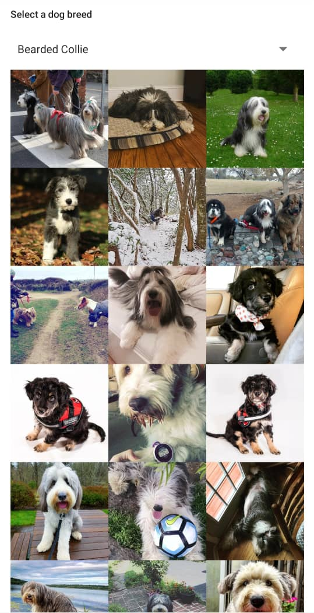

# Dogs App

This is a single screen Android application in Kotlin that lets the user pick a dog breed from a list and then fills a 3-column grid with images of dogs of the selected breed.

The app uses the [DogAPI](http://TheDogApi.com) to fetch the different dog breeds and when the user selects a breed from a drop down, the app fetches a list of dogs based on that breed.

Documentation for the DogAPI can be found [here](https://docs.thedogapi.com)

#### The app uses the following technologies:
* [MVVM Architecture](https://developer.android.com/jetpack/guide)
* [Android Jetpack](https://developer.android.com/jetpack) Libraries
* [Dagger2](https://dagger.dev/) for Dependency Injection
* [JUnit4](https://junit.org/junit4/) for Testing
* [Mockito](https://site.mockito.org/) for Mocking Test Dependencies
* [Coil](https://coil-kt.github.io/coil/getting_started/) for Image Loading
* [Retrofit](https://square.github.io/retrofit/) for Network Requests

## Screenshot
Here is a Screenshot of the app

